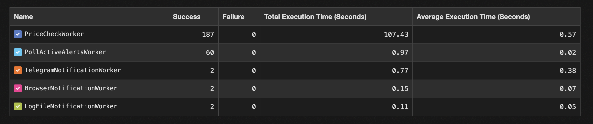

# Crypto Alert — Rails 8

A Rails 8 application to create crypto price alerts, manage notification channels, and dispatch notifications when thresholds are crossed. Prices are fetched from Binance. Background jobs use Sidekiq + Redis.

## Alerts


## Sidekiq Workers (Sidekiq UI)


## Screencast Tests


## Prerequisites
- Ruby 3.4.x
- PostgreSQL 14+
- Redis 6+

## Setup
```bash
bundle install
bin/rails db:prepare
```

Start Redis locally:
```bash
redis-server
```

Recommended ENV variables (development defaults are fine):
- `REDIS_URL` (default: `redis://localhost:6379/0`)
- `ALERTS_FROM` (default: `alerts@example.com`)

## Running
```bash
bin/rails server
```
Visit:
- App: http://localhost:3000
- Sidekiq UI (dev): http://localhost:3000/sidekiq

## Background Jobs & Scheduling
- Workers: `PriceCheckWorker`, `PollActiveAlertsWorker`
- Cron: configured via `config/sidekiq_schedule.yml` (runs poller every minute)
- Sidekiq/Redis configured in `config/initializers/sidekiq.rb`

## API
JSON endpoints are available for CRUD:
- Alerts: `GET/POST /alerts(.json)`, `PATCH/DELETE /alerts/:id(.json)`
- Channels: `GET/POST /notification_channels(.json)`, `PATCH/DELETE /notification_channels/:id(.json)`

## UI
- Basic CRUD views with Turbo Streams for live updates (append, replace, remove)
- Channels form accepts JSON for `settings`

## Testing
```bash
bundle exec rspec -f d
```

## Linting
```bash
bin/rubocop -A
```

## Deployment Notes
- Ensure PostgreSQL and Redis are available and `REDIS_URL` is set
- Precompile assets if needed: `bin/rails assets:precompile`
- Run Sidekiq process:
```bash
bundle exec sidekiq -C config/sidekiq.yml
```
- Schedule (sidekiq-cron) is loaded automatically on server boot via initializer

## Security
- Keep credentials and env vars secure
- Review `config/content_security_policy.rb` as needed
